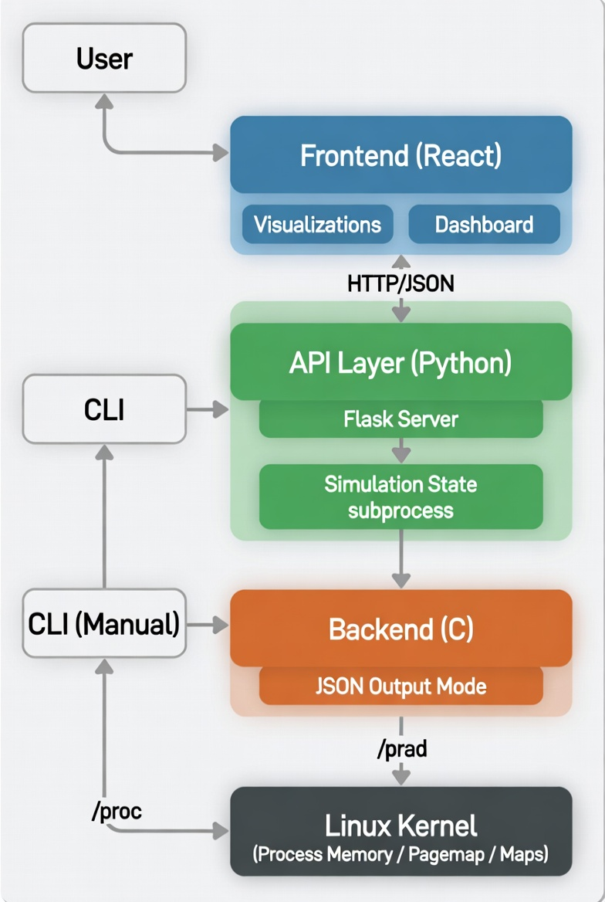

# Virtual Memory Visualization Tool

An interactive visualization tool for understanding virtual memory concepts in operating systems. Built with a C backend for core OS logic and a React frontend for beautiful visualizations.


## 🎯 Features

### Core Functionality
- **Process Memory Map Viewer** - Visualize memory regions (heap, stack, code, libraries)
- **Address Translation** - Translate virtual addresses to physical addresses
- **4-Level Page Table Walk** - Step-by-step visualization of x86_64 paging
- **TLB Simulator** - Interactive TLB with LRU, FIFO, Random, and Clock replacement
- **Demand Paging Simulator** - Physical memory frames, page faults, replacement policies
- **Memory Playground** - Active OS interaction with mmap(), mlock(), madvise()
- **Memory Statistics** - Real-time system and process memory info
- **Learn Mode** - Educational content on 8 OS concepts

### Technical Highlights
- **C Backend** - Reads directly from Linux `/proc` filesystem
- **Interactive Shell** - Full CLI for terminal demos with TLB and Paging simulation
- **React Frontend** - Modern UI with animations and dark theme
- **REST API** - Flask server bridging frontend and backend

## 📁 Project Structure

```
virtual-memory-visualizer/
│
├── backend/                        # C Backend
│   ├── src/
│   │   ├── vmem_shell.c            # Main interactive shell
│   │   ├── addr_translate.c/h      # Address translation logic
│   │   ├── proc_reader.c/h         # /proc filesystem reader
│   │   ├── tlb_sim.c/h             # TLB simulator
│   │   ├── paging_sim.c/h          # Demand paging simulator
│   │   ├── playground.c/h          # Memory playground (mmap/mlock)
│   │   ├── json_output.c/h         # JSON output for API
│   │   └── vmem_types.h            # Shared type definitions
│   ├── bin/                        # Compiled binaries
│   └── Makefile
│
├── api/                            # Python API Layer
│   ├── app.py                      # Flask server (all endpoints)
│   └── requirements.txt
│
├── frontend/                       # React Frontend
│   ├── src/
│   │   ├── App.jsx                 # Main app with routing
│   │   ├── index.css               # Global styles
│   │   ├── main.jsx                # Entry point
│   │   └── pages/
│   │       ├── Dashboard.jsx       # Home dashboard
│   │       ├── ProcessView.jsx     # Process memory viewer
│   │       ├── AddressTranslator.jsx # Page table walk UI
│   │       ├── TLBSimulator.jsx    # TLB simulation UI
│   │       ├── DemandPaging.jsx    # Demand paging UI
│   │       ├── MemoryPlayground.jsx # Memory playground UI
│   │       └── Learn.jsx           # Educational content
│   └── package.json
│
├── docs/                           # Documentation assets
│   └── architecture.jpeg           # System flowchart
│
└── README.md
```

### 🔄 System Architecture
```text
┌──────────────┐                                  ┌───────────────────────────┐
│   👤 User    │─────────────────────────────────►│   💻 Frontend (React)     │
└──────┬───────┘          (Browser)               │    - Visualizations       │
       │                                          │    - Dashboard            │
       │                                          └─────────────┬─────────────┘
       │                                                        │
       │                                                HTTP /  │
       │ (Terminal)                                     JSON    │
       │                                                        ▼
       │                                          ┌───────────────────────────┐
       │                                          │  🐍 API Layer (Python)    │
       │                                          │    - Flask Server         │
       │                                          │    - Simulation State     │
       │                                          └─────────────┬─────────────┘
       │                                                        │
       │                                            Subprocess  │
       │                                              Exec      │
       ▼                                                        ▼
┌──────────────┐                                  ┌───────────────────────────┐
│   ⚙️ CLI     │◄─────────────────────────────────│      ⚙️ Backend (C)       │
│  (Manual)    │                                  │   (JSON Output Mode)      │
└──────┬───────┘                                  └─────────────┬─────────────┘
       │                                                        │
       │ Reads /proc                                            │ Reads /proc
       │                                                        │
       ▼                                                        ▼
┌─────────────────────────────────────────────────────────────────────────────┐
│                           🐧 Linux Kernel                                   │
│                     (Process Memory / Pagemap / Maps)                       │
└─────────────────────────────────────────────────────────────────────────────┘
```

### 📊 Visual Flowchart


---

## 🚀 Installation & Setup

### 🐧 Option 1: Native Linux (Recommended)

**1. Build C Backend**
```bash
cd backend
make
```

**2. Test CLI (Optional)**
```bash
sudo make run
```

**3. Install Python Dependencies**
```bash
cd api
pip install -r requirements.txt
```

**4. Start API Server**
```bash
sudo python app.py
```
Server runs on `http://localhost:5000`

**5. Start React Frontend**
```bash
cd frontend
npm install
npm run dev
```
Frontend runs on `http://localhost:3000`

### 🖥️ Option 2: Windows with WSL

**1. Build Backend (WSL Terminal)**
```bash
cd /mnt/c/Users/YourName/path/to/virtual-memory-visualizer/backend
make
```

**2. Test CLI (Optional)**
```bash
sudo make run
```

**3. Install Python Deps (WSL)**
```bash
# Ubuntu/Debian
sudo apt update && sudo apt install -y python3-pip python3-flask
pip3 install flask-cors
```

**4. Run API (WSL)**
```bash
cd ../api
sudo python3 app.py
```

**5. Run Frontend (PowerShell)**
```powershell
cd ..\frontend
npm install
npm run dev
```

---

## 💻 CLI Commands & Examples

The tool includes a powerful interactive shell (`vmem_shell`) for demonstration.

### Process Commands

#### `ps`
List all running processes, sorted by memory usage (descending).
```
vmem> ps
  PID     NAME              MEMORY      STATE
  1892    firefox           524.3 MB    S
  2341    code              312.5 MB    S
  2541    python3           42.1 MB     S
```

#### `select <pid>`
Select a process to analyze.
```
vmem> select 1892
[OK] Selected process 1892 (firefox)
```

#### `unselect`
Deselect the current process.
```
vmem> unselect
[OK] Deselected process 1892 (firefox)
```

### Memory Analysis (requires selected process)

#### `maps`
Show memory regions (stack, heap, etc.) from `/proc/[pid]/maps`.
```
vmem> maps
  START ADDRESS     END ADDRESS       SIZE     PERM  TYPE           NAME
  0x55a4b2c00000    0x55a4b2d40000    1.3 MB   r-xp  Code           /usr/lib/firefox/firefox
  0x55a4b3000000    0x55a4b5000000    32.0 MB  rw-p  Heap           [heap]
```

#### `translate <addr>`
Translate a virtual address to a physical address using `/proc/[pid]/pagemap`.
```
vmem> translate 0x55a4b2c00000
Virtual Address:  0x55a4b2c00000
Virtual Page Num: 0x55a4b2c00
Physical Frame:   0x1a4b2c00
Physical Address: 0x1a4b2c00000
```

#### `pagewalk <addr>`
Simulate a 4-level page table walk (PML4 -> PDPT -> PD -> PT).
```
vmem> pagewalk 0x55a4b2c00000
PML4 Index:    0x0AB (bits 47-39)  → PML4[171] 
PDPT Index:    0x125 (bits 38-30)  → PDPT[293]
...
Physical Frame: 0x1a4b2c00
```

#### `stats`
Show detailed memory statistics for the process.
```
vmem> stats
Virtual Size:    2.4 GB
Resident (RSS):  524.3 MB
Data Segment:    1.1 GB
```

#### `faults`
Show page fault statistics (minor/major).

### TLB Simulator

#### `tlb init <size> [policy]`
Initialize the TLB. Policies: `LRU`, `FIFO`, `RANDOM`, `CLOCK`.
```
vmem> tlb init 8 LRU
[OK] TLB initialized with 8 entries (LRU replacement)
```

#### `tlb access <addr>`
Access an address. If not in TLB, it's a MISS (and inserted).
```
vmem> tlb access 0x1000
[TLB MISS] VPN 0x1 not found
[TLB INSERT] VPN 0x1 -> PFN 0x1 (simulated)

vmem> tlb access 0x1000
[TLB HIT] VPN 0x1 -> PFN 0x1
```

#### `tlb status`
Show current TLB entries and hit/miss statistics.

#### `tlb flush`
Clear all TLB entries.

### Demand Paging Simulator

#### `paging init <frames> [policy]`
Initialize physical memory frames.
```
vmem> paging init 4 FIFO
[OK] Paging simulator initialized with 4 frames
```

#### `paging access <addr>`
Access a page. Simulates page faults and eviction.
```
vmem> paging access 0x5000
[PAGE FAULT] VPN 0x5 not in memory, evicted VPN 0x1 from Frame 0
```

#### `paging status`
Show current frames and loaded pages.

### Memory Playground (Active OS Interaction)

#### `mem alloc <mb>`
Allocate memory using `mmap()`.
```
vmem> mem alloc 50
[OK] Allocated 50 MB (Region #0) at 0x7f8a40000000
```

#### `mem lock <id>`
Lock a memory region using `mlock()`, preventing it from being swapped.
```
vmem> mem lock 0
[OK] Locked Region #0
```

#### `mem advise <id> <hint>`
Apply `madvise()` hints like `WILLNEED`, `DONTNEED`, `SEQUENTIAL`, `RANDOM`.
```
vmem> mem advise 0 SEQUENTIAL
[OK] Applied SEQUENTIAL hint to Region #0
```

#### `mem free <id>` / `mem reset`
Free specific or all allocated regions.

---

## 🖥️ Frontend Guide

Measurements and visualizations are available via the web interface:

1.  **Dashboard**: System-wide memory overview and top processes.
2.  **Process View**: Select a process to see its memory map (Code/Heap/Stack) and permissions.
3.  **Address Translator**: Enter a virtual address to see the exact 4-level page table derivation.
4.  **TLB Simulator**: Visual simulation of TLB hits/misses. Click squares to access pages and watch the cache fill.
5.  **Demand Paging**: Watch pages move in and out of physical frames. Green = Loaded, Red = Evicted.
6.  **Memory Playground**: Use sliders to allocate real system memory and toggle locks to see OS behavior.

---

## 🧪 OS Concepts Demonstrated

| Concept | Explanation |
|---------|-------------|
| **Virtual Memory** | How OS abstracts physical RAM into a large virtual address space. |
| **Address Translation** | Mapping Virtual Page Numbers (VPN) to Physical Frame Numbers (PFN). |
| **Page Tables** | Hierarchical structures (PML4, PDPT, PD, PT) used for translation. |
| **TLB** | Specialized cache to speed up translation. |
| **Demand Paging** | Loading pages only when accessed (Page Faults). |
| **Page Replacement** | Algorithms (LRU, FIFO) to decide which page to evict when memory is full. |
| **Memory Regions** | Segments like Stack (local vars), Heap (dynamic alloc), Code (instructions). |
| **Memory Protection** | Permissions (Read/Write/Execute) enforcing security. |

---

## 🔧 API Endpoints

| Method | Endpoint | Description |
|--------|----------|-------------|
| `GET` | `/api/processes` | List all processes |
| `GET` | `/api/process/<pid>/maps` | Get memory regions |
| `GET` | `/api/process/<pid>/translate/<addr>` | Translate address |
| `GET` | `/api/system/memory` | System memory info |
| `POST` | `/api/tlb/init` | Initialize TLB |
| `POST` | `/api/tlb/access` | Access TLB |
| `POST` | `/api/paging/init` | Initialize paging |
| `POST` | `/api/paging/access` | Access page |
| `POST` | `/api/playground/allocate` | Allocate memory `{size_mb}` |
| `POST` | `/api/playground/lock` | Lock region `{id}` |
| `POST` | `/api/playground/advise` | Apply advice `{id, advice}` |
| `GET` | `/api/playground/status` | Get playground status |

---

## 👥 Team

**OS Lab Project - Virtual Memory Visualization Tool**

*   **Advik Aggarwal** (1RV24CS019)
*   **Aarti Shirvante Pai** (1RV24CS006)
